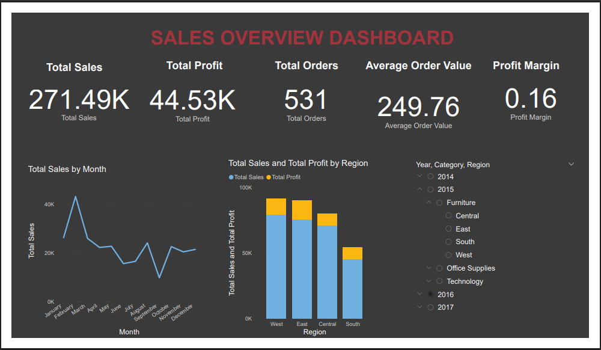
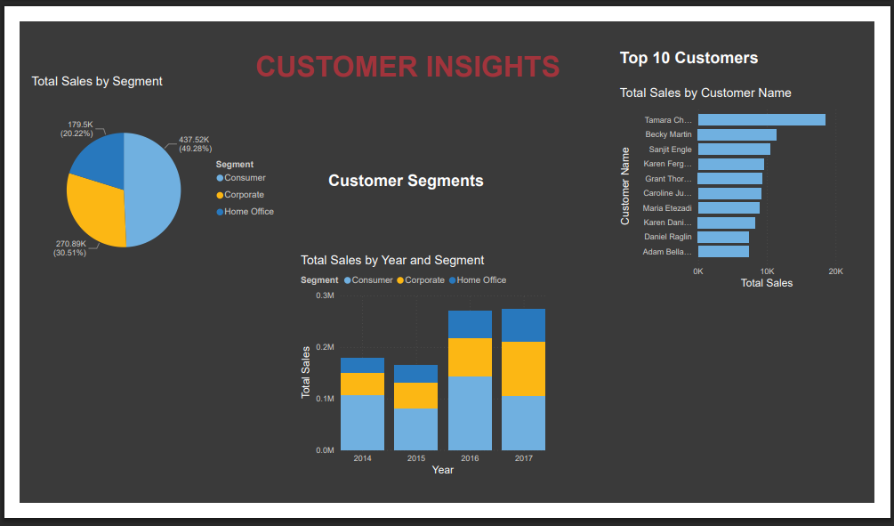
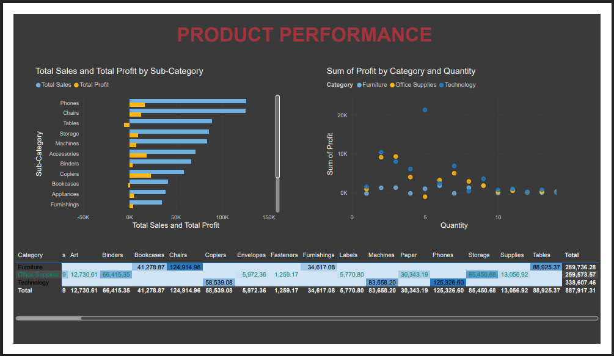
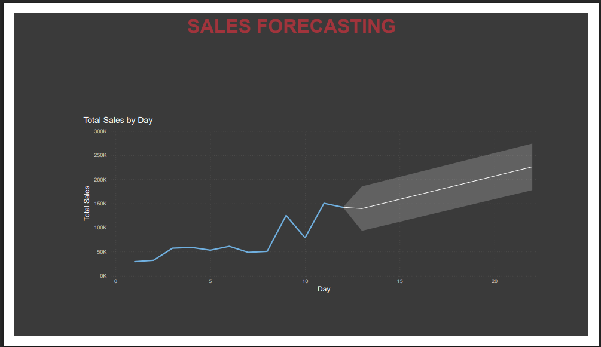

# 📊 E-Commerce Sales & Customer Behavior Dashboard (Power BI)

An advanced Power BI dashboard designed to analyze sales trends, customer behavior, product performance, and future forecasts for an e-commerce business. This project highlights best practices in data modeling, DAX, forecasting, interactivity, and dashboard design.

---

## 🚀 Project Overview

This dashboard helps users and stakeholders to:
- Analyze total sales and profit over time
- Identify top-performing regions, customers, and product categories
- Forecast future sales with confidence intervals
- Navigate interactive pages with slicers and tooltips
- Gain actionable insights for marketing, finance, and operations

---

## 📁 Dataset

**Source**: [Kaggle – Superstore Dataset](https://www.kaggle.com/datasets/vivek468/superstore-dataset-final)

- Rows: ~10,000
- Key fields: Order Date, Region, Segment, Category, Sub-Category, Sales, Profit, Quantity

---

## 📐 Features by Page

### 📌 Page 1 – Sales Overview
- KPI Cards: Total Sales, Total Profit, Profit Margin, Order Count, Avg Order Value
- Monthly Sales Trend (Line Chart)
- Regional Sales & Profit (Bar Chart)
- Interactive Slicers: Year, Region, Category

### 👥 Page 2 – Customer Insights
- Segment Distribution (Pie Chart)
- Top 10 Customers by Sales (Bar Chart)
- Year-wise Sales per Segment (Column Chart)

### 📦 Page 3 – Product Performance
- Sales & Profit by Sub-Category (Bar Chart)
- Profit vs Quantity per Product (Scatter Plot)
- Category/Sub-Category Matrix with Conditional Formatting

### 🔮 Page 4 – Forecasting
- Line Chart with 6-Month Forecast using Analytics Pane
- Visual forecast using historical sales

---

## 🧼 Dashboard Polishing Highlights

| Feature | Description |
|--------|-------------|
| 🎨 **Color Theme** | Custom theme applied for branding consistency |
| 🎚 **Slicers** | Interactive filters by year, region, segment |
| 🖌 **Visual Titles** | Consistent font size, naming, and formatting |
| 📉 **Forecasting** | 6-month predictive sales trend line |
| 💡 **Conditional Formatting** | Applied to matrix for data bars or color scaling |

---

## 📊 Key DAX Measures

```DAX
Total Sales = SUM('Sample - Superstore'[Sales])
Total Profit = SUM('Sample - Superstore'[Profit])
Total Orders = DISTINCTCOUNT('Sample - Superstore'[Order ID])
Profit Margin = DIVIDE([Total Profit], [Total Sales])
Average Order Value = AVERAGE('Sample - Superstore'[Sales])
```

---

## 📸 Screenshots

| Sales Overview | Customer Insights | Product Performace | Sales Forecasting |
|----------------|-------------------|--------------------|-------------------|
|  |  |  | |

---

## 📂 How to Use

1. Clone or download this repository:

2. Open the `.pbix` file in Power BI Desktop.

3. Replace or refresh the data source via **Transform Data → Data Source Settings** if needed.

4. Customize for your own business domain or branding.

---

## 🎯 Learning Outcomes

- Advanced DAX for KPIs
- Dynamic interactivity with slicers & tooltips
- Visual storytelling using conditional formatting
- Time-based sales forecasting
- Clean report design & layout polishing

---


## 🧑‍💻 Author

**Jeffy James**  
Power BI & Data Analytics Enthusiast  


